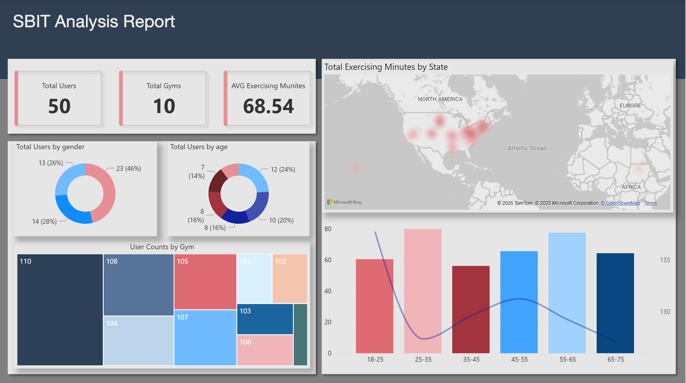

# SBIT Project - Azure Data Platform

An end-to-end Azure data platform using a Medallion (Bronze/Silver/Gold) model to process fitness-related data with batch + streaming ingestion, Databricks transformations, and Power BI reporting.

## Table of Contents

1. [Project Overview](#project-overview)
2. [Architecture](#architecture)
3. [Data Flow](#data-flow)
4. [Components](#components)
   - [Azure Functions](#azure-functions)
   - [Azure Data Factory](#azure-data-factory)
   - [Azure Databricks](#azure-databricks)
5. [Data Layers](#data-layers)
   - [Bronze Layer](#bronze-layer)
   - [Silver Layer](#silver-layer)
   - [Gold Layer](#gold-layer)
6. [Reports](#reports)
7. [CI/CD](#cicd)

---

## Project Overview

This project builds a scalable pipeline for:
- Batch ingestion (CSV) and streaming-style ingestion (JSON → Kafka)
- Databricks processing into Bronze/Silver/Gold Delta tables
- Automated quality checks (Great Expectations) and quarantine for invalid records

---

## Architecture

## Power BI Report

---

## Data Flow

1. **Ingest**
   - **CSV**: ADF copies CSV files from GitHub to ADLS Gen2 (`data_zone/input/`)
2. **Stream through Kafka**
   - Azure Functions publish JSON events to Kafka topics (`user_info`, `bpm`, `workout`)
   - Azure Functions consume Kafka topics and write a multiplexed raw dataset to ADLS Gen2 (`data_zone/raw/`)
3. **Transform**
   - Databricks notebooks/jobs process Bronze → Silver → Gold using Structured Streaming patterns and Delta MERGE where needed
4. **Validate**
   - Great Expectations runs at ingestion (Bronze) and sends invalid rows/batches to quarantine tables for traceability

---

## Components

### Azure Functions

- **Location**: `functions/`
- **Purpose**: Bridge ADLS Gen2 and Kafka (producer/consumer pairs)
  - `SBIT_bmp_azure_function` → Kafka topic `bpm`
  - `SBIT_user_info_azure_function` → Kafka topic `user_info`
  - `SBIT_workout_azure_function` → Kafka topic `workout`

### Azure Data Factory

- **Location**: `SBIT_ADF_Code/`
- **Purpose**: Copy CSV from GitHub to ADLS Gen2 input zone; orchestrate ingestion pipelines

### Azure Databricks

- **Locations**:
  - Notebooks: `databricks_notebooks/`
  - Bundle project: `sbit_medallion_pipeline/`
- **Purpose**: Bronze/Silver/Gold transformations, Great Expectations validation, and integration testing via a Databricks Bundle job

---

## Data Layers

### Bronze Layer

- **What**: Raw landing tables (schema enforced) for CSV + Kafka multiplex output
- **Quality**: Great Expectations validation + quarantine for failures

### Silver Layer

- **What**: Cleaned/enriched tables (dedupe, CDC/upserts, event matching)

### Gold Layer

- **What**: Aggregated analytics tables powering the Power BI report (e.g., workout + BPM summaries, gym utilization)

---

## Reports

- **Location**: `report/`
- **Power BI**: `report/SBIT_analysis_report.pbix`
- **Sample dashboard**: `report/sample/dashboard.png`

---

## CI/CD

This repo includes GitHub Actions pipelines to deploy infrastructure and continuously validate the Databricks bundle.

### Terraform CI/CD (Infra)

- **Workflow**: `.github/workflows/terraform.yml`
- **Triggers**: PRs and pushes to `main`
- **What it does**:
  - `terraform init`
  - `terraform plan` (PR + push)
  - `terraform apply` (only on `main` branch push)

### Databricks Bundle Deploy + Integration Test

- **Workflow**: `.github/workflows/bundle_test.yml`
- **Triggers**: pushes to `main` that touch:
  - `sbit_medallion_pipeline/src/**`
  - `sbit_medallion_pipeline/tests/**`
  - `sbit_medallion_pipeline/resources/**`
  - `sbit_medallion_pipeline/databricks.yml`
- **What it does**:
  - Validates the bundle (`databricks bundle validate -t dev`)
  - Deploys the bundle to Dev (`databricks bundle deploy -t dev`)
  - Runs the integration test job (`databricks bundle run sbit_integration_test_job -t dev`)

### Secrets / Notifications

- **Required GitHub Secrets**:
  - `AZURE_CREDENTIALS` (JSON containing `clientId`, `clientSecret`, `subscriptionId`, `tenantId`)
  - `DATABRICKS_HOST`
  - `DATABRICKS_TOKEN`
- **Failure notifications**:
  - If the integration test fails, the workflow fails; GitHub Actions will send notifications (including email) according to GitHub notification settings.

